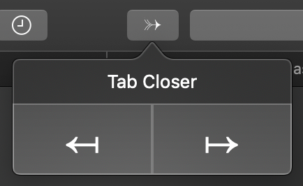

# Tab-Closer
A Safari Extension that helps closing tabs.

[Mac App Store](https://itunes.apple.com/WebObjects/MZStore.woa/wa/viewSoftware?id=1485958094&mt=12)

Safari is my most-commonly used browser on macOS, and I really hope that it allows closing all tabs to a specified direction at once, but so far this feature has been missing, so I have written a Safari Extension to help with this.
